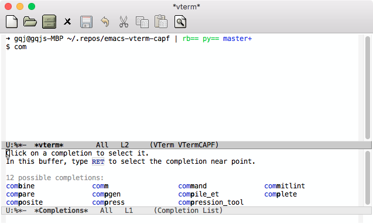
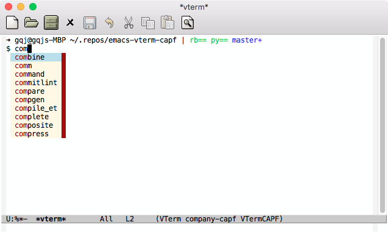
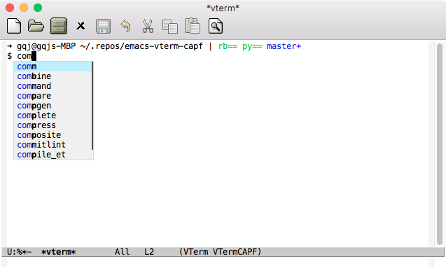

# vterm-capf

Vterm `completion-at-point` facilities.


## Requirements

- Emacs 25.1
- vterm-20220613.1614
- company (optional)
- corfu (optional)


## Installation

Clone or download this repository (path of the folder is the `<path-to-vterm-capf>` used below).


## Configuration

### Basic

Trigger completion by calling `completion-at-point`.

```elisp
(add-to-list 'load-path "<path-to-vterm-capf>")
(setq vterm-capf-frontend nil)
(add-hook 'vterm-mode-hook #'vterm-capf-mode)
```



### With completion frontend

- company

```elisp
(add-to-list 'load-path "<path-to-vterm-capf>")
(setq vterm-capf-frontend 'company)
(add-hook 'vterm-mode-hook #'vterm-capf-mode)
(global-company-mode)
```



- corfu

```elisp
(add-to-list 'load-path "<path-to-vterm-capf>")
(setq vterm-capf-frontend 'corfu)
(add-hook 'vterm-mode-hook #'vterm-capf-mode)
(require 'corfu)
(setq corfu-auto t)
(setq corfu-quit-at-boundary t)
(setq corfu-preview-current nil)
(define-key corfu-map (kbd "C-p") #'corfu-previous)
(define-key corfu-map (kbd "C-n") #'corfu-next)
(define-key corfu-map (kbd "RET") #'corfu-complete)
(define-key corfu-map [return]    #'corfu-complete)
(global-corfu-mode)
```


